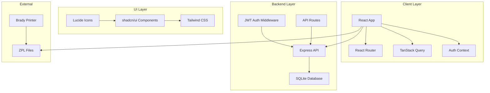

# Design Document

## Overview

The WireIndex system is a React-based web application with Express backend that provides professional cable labeling capabilities for Brady printers. The system follows a modern full-stack architecture with role-based access control, real-time data synchronization, and ZPL label generation.

### Key Design Principles

- **Security First**: Row Level Security (RLS) and role-based permissions at every layer
- **User Experience**: Intuitive interface with real-time feedback and validation
- **Scalability**: Component-based architecture supporting multiple sites and users
- **Reliability**: Comprehensive error handling and data validation
- **Performance**: Optimized queries and efficient state management

## Architecture

### High-Level Architecture



### Technology Stack

- **Frontend**: React 18 + TypeScript + Vite for fast development and type safety
- **Styling**: Tailwind CSS + shadcn/ui for consistent, accessible components
- **Backend**: Node.js + Express + SQLite for local database storage
- **Authentication**: JWT tokens with local session management
- **State Management**: TanStack React Query for server state and caching
- **Routing**: React Router DOM for client-side navigation
- **Validation**: Zod + React Hook Form for type-safe form handling
- **Database**: SQLite with better-sqlite3 for local file-based storage

## Components and Interfaces

### Authentication System

**AuthProvider Context**
```typescript
interface AuthContextType {
  user: User | null;
  session: Session | null;
  signIn: (email: string, password: string) => Promise<void>;
  signUp: (email: string, password: string, fullName: string) => Promise<void>;
  signOut: () => Promise<void>;
  resetPassword: (email: string) => Promise<void>;
  loading: boolean;
}
```

**ProtectedRoute Component**
- Wraps authenticated routes
- Redirects to /auth if not authenticated
- Provides loading states during auth checks

### Permission System

**usePermissions Hook**
```typescript
interface PermissionHook {
  hasRole: (role: UserRole) => boolean;
  canAccess: (tool: string) => boolean;
  canCreate: (tool: string) => boolean;
  canEdit: (tool: string) => boolean;
  canDelete: (tool: string) => boolean;
  isAdmin: boolean;
}
```

**Role Hierarchy**
- Admin: Full system access, user management, settings
- Moderator: Limited admin functions, advanced features
- User: Basic label creation and site management

### Core Components

**Layout Structure**
```
App
├── AuthProvider
├── BrowserRouter
└── Routes
    ├── /auth → Auth (public)
    └── ProtectedRoute → Layout
        ├── Navigation
        ├── UserMenu
        └── Outlet (page content)
```

**Navigation Component**
- Top navigation bar with logo and user menu
- Role-based menu items visibility
- Active route highlighting
- Responsive mobile menu

**Form Components**
- Standardized form layouts with validation
- Real-time error display
- Loading states for submissions
- Toast notifications for feedback

## API Design

### Express Server Structure
```
server/
├── routes/
│   ├── auth.js          # Authentication endpoints
│   ├── users.js         # User management
│   ├── sites.js         # Site CRUD operations
│   ├── labels.js        # Label management
│   └── admin.js         # Admin functions
├── middleware/
│   ├── auth.js          # JWT validation
│   ├── permissions.js   # Role-based access
│   └── validation.js    # Request validation
├── models/
│   ├── User.js          # User data operations
│   ├── Site.js          # Site data operations
│   └── Label.js         # Label data operations
├── database/
│   ├── connection.js    # SQLite connection
│   ├── migrations/      # Database schema updates
│   └── seeds/           # Initial data
└── app.js               # Express app setup
```

### API Endpoints
- **POST /api/auth/login** - User authentication
- **POST /api/auth/register** - User registration
- **POST /api/auth/refresh** - Token refresh
- **GET /api/sites** - List user sites
- **POST /api/sites** - Create new site
- **GET /api/labels** - List user labels
- **POST /api/labels** - Create new label
- **GET /api/admin/users** - Admin user management
- **POST /api/admin/invite** - Invite new user

## Data Models

### Database Schema Design

**SQLite Database Structure**
- **users**: Authentication and profile information with password hashing
- **sites**: Physical locations for cable management
- **labels**: Cable label records with references
- **user_roles**: Role assignments (admin, moderator, user)
- **tool_permissions**: Granular access control per user/tool
- **app_settings**: Application configuration storage
- **user_invitations**: Pending user invitations with tokens

**Relationships**
- users → sites (one-to-many via user_id)
- sites → labels (one-to-many via site_id)
- users → labels (one-to-many via user_id)
- users → user_roles (one-to-many via user_id)
- users → tool_permissions (one-to-many via user_id)

### Key Database Features

**Application-Level Security**
- Password hashing with bcrypt
- JWT token-based authentication
- Middleware-based authorization checks
- User data isolation through API layer

**Database Triggers**
- Automatic timestamp updates
- Default permission assignment on user creation
- Reference number auto-increment per site

**Reference Number Generation**
```sql
-- Auto-increment reference numbers per site
SELECT COALESCE(MAX(CAST(SUBSTR(reference_number, INSTR(reference_number, '-') + 1) AS INTEGER)), 0) + 1
FROM labels 
WHERE site_id = ?;
```

## ZPL Generation Logic

### Cable Labels
```zpl
^XA
^MUm^LH8,19^FS
^MUm^FO0,2
^A0N,7,5
^FB280,1,1,C
^FD[SITE]-[REF] [SOURCE] > [DEST]
^FS
^XZ
```

### Port Labels (3 per page)
```zpl
^XA
^MUm^LH8,19^FS
^MUm^FO[x_offset],2
^A0N,7,5
^FB280,1,1,C
^FD[SID]/[PORT]
^FS
^XZ
```

**ZPL Generation Service**
```typescript
interface ZPLGenerator {
  generateCableLabel(site: string, ref: string, source: string, dest: string): string;
  generatePortLabels(sid: string, fromPort: number, toPort: number): string;
  generatePDULabels(pduSid: string, fromPort: number, toPort: number): string;
}
```

## Page Architecture

### Dashboard (/dashboard)
- Welcome message with user context
- Real-time statistics cards
- Quick action navigation
- Recent activity feed
- Permission-based feature visibility

### Label Creation (/create)
- Site selection dropdown
- Source/destination input fields
- Real-time reference number preview
- ZPL generation and download
- Form validation and error handling

### Sites Management (/sites)
- CRUD operations for sites
- Search and filter functionality
- Site details with location info
- Associated labels count
- Bulk operations support

### Label Database (/database)
- Paginated label listing
- Advanced search and filtering
- Bulk ZPL export functionality
- Edit/delete operations
- Sort by multiple columns

### Port/PDU Label Generators (/port-labels, /pdu-labels)
- Range input validation
- Batch ZPL generation
- Download as .txt files
- Preview functionality
- Error handling for invalid ranges

### Admin Panel (/admin)
- User management interface
- Role assignment controls
- Permission matrix management
- Application settings
- User statistics and analytics

## Error Handling

### Client-Side Error Handling
- Form validation with Zod schemas
- Network error recovery with retry logic
- User-friendly error messages
- Loading states for async operations
- Graceful degradation for offline scenarios

### Server-Side Error Handling
- Database constraint validation
- Authentication/authorization errors
- Edge function error responses
- Audit logging for security events
- Rate limiting and abuse prevention

### Error Boundaries
- React error boundaries for component failures
- Fallback UI components
- Error reporting and logging
- Recovery mechanisms where possible

## Security Design

### Authentication Flow
1. User submits credentials to Express API
2. Server validates credentials against SQLite database
3. JWT token generated and returned to client
4. Token stored in localStorage with automatic refresh
5. Token validation on protected API routes

### Authorization Layers
1. **Route Level**: ProtectedRoute component checks for valid token
2. **Component Level**: Permission-based rendering using user context
3. **API Level**: JWT middleware validates tokens on all protected routes
4. **Database Level**: User ID filtering in all data queries

### Data Protection
- Password hashing with bcrypt (12 rounds minimum)
- JWT tokens with expiration and refresh mechanism
- Input sanitization and validation on all endpoints
- CORS configuration for frontend-only access
- Environment variables for JWT secrets

## Testing Strategy

### Unit Testing
- Component rendering and behavior
- Hook functionality and state management
- Utility functions and helpers
- Form validation logic
- ZPL generation accuracy

### Integration Testing
- Authentication flows with JWT tokens
- Database operations with SQLite
- Permission system validation
- API endpoint functionality
- Local server startup and shutdown

### End-to-End Testing
- Complete user workflows
- Cross-browser compatibility
- Mobile responsiveness
- Performance benchmarks
- Security vulnerability scanning

### Testing Tools
- Vitest for unit testing
- React Testing Library for component tests
- Playwright for E2E testing
- In-memory SQLite for integration tests

## Performance Considerations

### Frontend Optimization
- Code splitting with React.lazy
- Image optimization and lazy loading
- Memoization for expensive calculations
- Virtual scrolling for large lists
- Bundle size monitoring

### Backend Optimization
- Database indexing strategy
- Query optimization with proper joins
- Connection pooling
- Edge function cold start mitigation
- CDN for static assets

### Caching Strategy
- TanStack Query for API response caching
- Browser caching for static resources
- Database query result caching
- Edge function response caching

## Deployment Architecture

### Environment Configuration
- Development: Local Express server + SQLite + Vite dev server
- Production: Packaged desktop app with embedded database
- Portable: Single executable with database file

### Local Deployment
- Express server runs on configurable port (default 3001)
- SQLite database file stored in user data directory
- Frontend built and served as static files
- Database migrations run automatically on startup

### Application Distribution
- Electron wrapper for desktop distribution
- Portable executable with embedded Node.js runtime
- Database backup and restore functionality
- Configuration file for customization