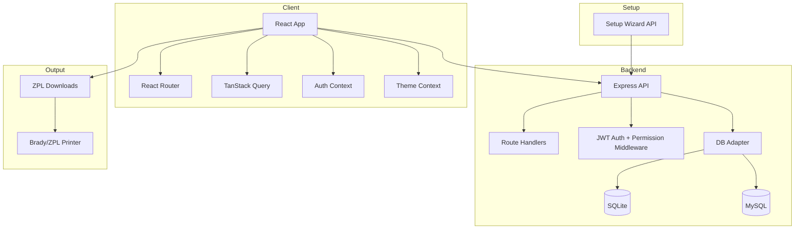

# Design Document

## Overview

CableIndex is a React + TypeScript web application with an Express + TypeScript API backend. It generates ZPL for Brady printers, stores label records per site, and provides role-based access controls.

This document describes the current (2026) design and architecture.

### Key Design Principles

- **Single source of truth**: Authorization and scoping are enforced on the backend.
- **Site-scoped data**: Labels, locations, and cable types are scoped to a site.
- **Operator-friendly**: First-run setup wizard avoids manual configuration.
- **Print correctness**: ZPL output is deterministic and test-validated.

## Architecture

### High-Level Architecture



### Runtime Modes

- **Development**
  - Frontend: Vite dev server
  - Backend: Express API
  - API calls go to `/api` (via dev proxy or `VITE_API_URL` override)

- **Production (Docker)**
  - Single container
  - Express serves the built frontend and the API under the same origin (`/` and `/api`)

## Major Subsystems

### Setup Wizard

- Until setup is complete, the backend exposes setup endpoints and blocks normal use.
- Setup allows selecting SQLite or MySQL, testing connectivity, and creating the initial admin.
- Setup persists configuration so restarts do not require reconfiguration.

### Authentication & Invitations

- Users authenticate with email/password.
- The backend issues access + refresh JWTs.
- Registration is invitation-driven:
  - Admin creates invitation with site assignments.
  - User accepts invitation via token.
- SMTP is optional:
  - SMTP config can come from environment variables or Admin Settings (stored in `app_settings`).

### Authorization Model

- **Global roles**: Global Admin, Admin, User.
- **Site roles**: Site Admin, Site User.
- Backend enforces:
  - Authentication (JWT)
  - Site scoping (e.g., requires `site_id` for label operations)
  - Role checks for admin and site-admin actions

### Data Model (Conceptual)

- **Users**: identity, password hash, global role
- **Sites**: user-visible groupings
- **Site Memberships**: per-user, per-site role assignments
- **Locations**: structured locations per site (`label/floor/suite/row/rack`)
- **Cable Types**: per-site categories
- **Labels**: cable labels with per-site reference numbering and associated metadata
- **App Settings**: system configuration (including optional SMTP settings)
- **Invitations**: invitation tokens and expiry/acceptance status

## Frontend Design

### Routing & Pages

- The primary workflow is **site-centric**:
  - Users land on Sites, select a site, then create/manage labels for that site.
- A dedicated Tools page provides generator utilities (RESID, 30DAY, TEXT, RACKS, IN-RACK, PORTS, PDU).
- Admin pages are restricted based on global role.

### Theme System

- Tailwind uses `darkMode: ["class"]`.
- The theme is stored in `localStorage` under `cableindex-theme`.
- The app toggles the `dark` class on the `<html>` element so all components (including dialogs/menus) inherit the theme.

## ZPL Generation

### Cable Label Payload

Printed payload (cross-rack cable label):

`#<REF>\& <SOURCE>\& <DESTINATION>`

### Formatting Rules

- ZPL is produced as a sequence of newline-separated commands.
- `^FD...` and its terminator `^FS` must be on separate lines.
- Bulk outputs are concatenated cleanly (labels do not run into each other).

### Example (Simplified)

```zpl
^XA
...
^FD#0001\& MDF-A/1/2/A/R01\& IDF-B/2/1/B/R03
^FS
...
^XZ
```

## Testing

- **Backend**: Vitest unit/integration tests, including strict ZPL structure assertions.
- **Frontend**: Vitest + Testing Library for component and integration tests.
- Backend tests use SQLite in-memory mode for speed and isolation.

## Non-Goals

- Database-enforced RLS (CableIndex enforces permissions in the API layer).
- Supabase edge functions.
- Electron/desktop packaging (not part of current deployment model).